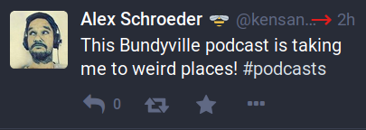

# Mastodon Blocker

This tool allows you to mass-block people on Mastodon. This is an
emergency tool when you're being harassed by a mob. It helps to block
people faster. Ideally, they are blocked before they even harass you.
And yes, innocent people will get caught up in this. But when you're
being harassed by a mob, maybe that's the kind of trade-off you're
willing to make.

My hope is that something like this eventually makes it into all the
Mastodon clients, and into the Mastodon web UI and the Mastodon client
API (in order to make it easy to use). For more discussion, see issue
[#8680](https://github.com/tootsuite/mastodon/issues/8680), "Chain
Blocking."

<!-- markdown-toc start - Don't edit this section. Run M-x markdown-toc-refresh-toc -->
**Table of Contents**

- [Installation](#installation)
- [Using it](#using-it)
- [Alternatives](#alternatives)

<!-- markdown-toc end -->

## Installation

Here's how it works. You need Python 3 and you need the `Mastodon.py`
library installed.

```
pip3 install Mastodon.py
```

Copy the script and make it executable:

```
curl https://alexschroeder.ch/cgit/mastodon-blocker/plain/mastodon-blocker > mastodon-blocker
chmod +x mastodon-blocker
```

(Please help me improve this process?)

## Using it

Start the tool with your account:

```
./mastodon-blocker kensanata@octodon.social
```

If you haven't authorized it, now's the time to do it. It prints a URL
which you need to visit, authorize the app, copy the authorization
code and paste it.

```
Registering app...
This app needs access to your Mastodon account.
Visit the following URL and authorize the app:
[it prints a long URL]
Then paste the access token here:
[you paste a long code]
Verifying the code...
Logging in...
Load the current blocks...
64 people already blocked
```

Now you're ready! This is the prompt:

```
Toot>
```

Copy and paste a URL to a toot. You get this URL right-click on the
timestamp of a toot. In the Mastodon web user-interface, that's either
the time elapsed in the top-right corner or the date in the
bottom-left corner:




Or you can also take the URL of your browser if you've clicked on the
toot. It's all good. All we care about is the number, the id. Either
of these two formats will do:

```
https://octodon.social/@kensanata/100719339320366538
https://octodon.social/web/statuses/100719339320366538
```

Here's an example:

```
Toot> https://octodon.social/@kensanata/100719476477868576
Processing 100719476477868576
1 people favourited this toot
0 people boosted this toot
Blocking kensanata@dice.camp
```

And what happens if you do it again? Nothing!

```
Toot> https://octodon.social/@kensanata/100719476477868576
Processing 100719476477868576
1 people favourited this toot
0 people boosted this toot
kensanata@dice.camp is already blocked
```

Keep repeating this for every toot you see.

That's it! Stay safe. May you never be harassed by the mob.

## Alternatives

There's a web app that does a similar thing:

* [Mastodon De-Mob](https://mastodon-de-mob.codesections.com/)
